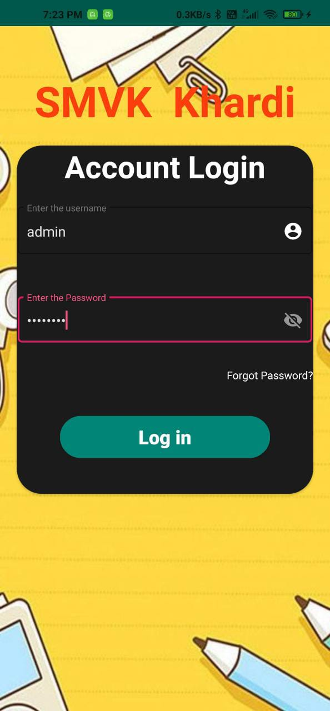

# AttendanceManagementSystem

* Created an Android application using Java,XML and Android Studio to take attendance of student.
* Processed student attendance inputted information in the back-end of the app to it send message to absent student
parents based on the student selected.
* Created app for SVMK, Khardi government school which is sponsered and it reduced 89 percent paper work

###  ScreenShots
  

